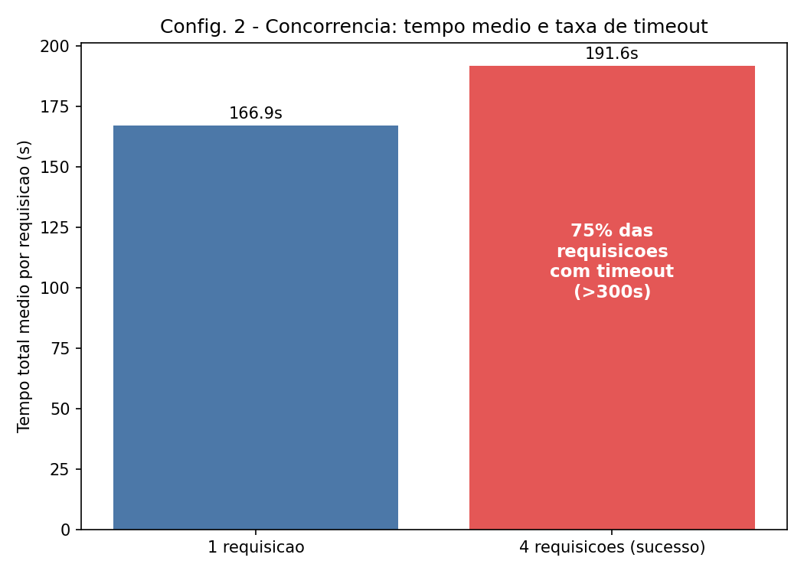
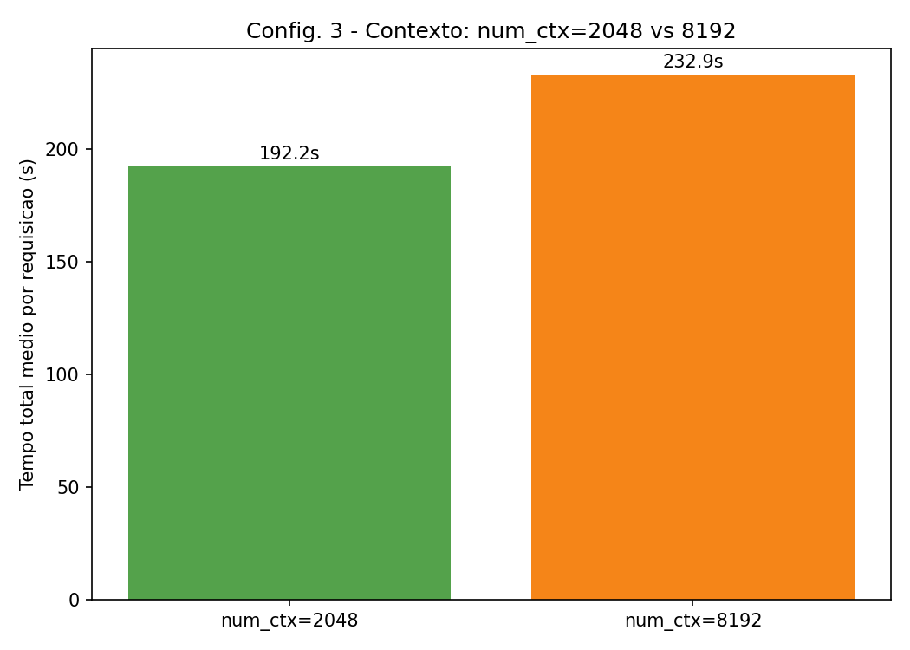

# Relatório Técnico — Atividade 1 (AV1) de Sistemas Operacionais
## Processos, Threads, Escalonamento e Inferência Local com Ollama

**Discente:** Leticia Cavalcanti
**Modalidade:** Individual
**Trilha:** A — Chat local: Ollama + Open WebUI
**Modelo:** Llama-3.2-3B-Instruct (GGUF, Q4_K_M)
**Repositório:** _(preencher com a URL do GitHub, ex.: https://github.com/<usuario>/SO_UFS_2026_2_Cavalcanti_Leticia)_
**Vídeo da atividade:** _(preencher — ver VIDEO.md)_
**Data:** 2026-09-15

---

## 1. Introdução e problema

Aplicações de IA generativa executadas localmente mobilizam processos, threads, memória,
armazenamento, comunicação em rede, arquivos, logs, bibliotecas, runtimes e mecanismos de
proteção do sistema operacional. Este relatório documenta a instalação, execução e análise
experimental de um sistema local de IA generativa baseado em **Ollama** com a interface
**Open WebUI** (Trilha A), relacionando conceitos de Sistemas Operacionais — processos, threads,
chamadas de sistema e escalonamento — ao comportamento observado.

**Pergunta norteadora:** como a camada de aplicação, o modelo de linguagem, a quantidade de
parâmetros, a quantização e a configuração de execução afetam processos, threads, uso de CPU,
memória, armazenamento e responsividade de um sistema local de IA generativa?

## 2. Trilha e modelo

- **Trilha escolhida:** A — Ollama + Open WebUI.
- **Modelo:** Llama-3.2-3B-Instruct, família Llama 3.2, variante Instruct, ~3,21 bilhões de
  parâmetros, formato GGUF, quantização Q4_K_M, licença Llama 3.2 Community License.
- **Model card:** https://huggingface.co/meta-llama/Llama-3.2-3B-Instruct
- **Justificativa:** modelo de porte reduzido (dentro do limite de 10B parâmetros), o que
  permite instalação e execução mais rápidas em ambiente local via Ollama. A quantização
  Q4_K_M reduz o consumo de memória e armazenamento sem comprometer significativamente a
  qualidade das respostas, facilitando a coleta de métricas de processos, threads, uso de
  CPU/memória e chamadas de sistema exigidas na Trilha A.
- **Nota de proveniência:** ver observação no [README.md](../README.md) sobre a diferença entre
  o model card original (safetensors, gated) e o artefato GGUF Q4_K_M efetivamente executado
  (biblioteca oficial do Ollama, tag `llama3.2:3b`).

## 3. Ambiente experimental

Inventário completo em [data/ambiente_inventario.txt](../data/ambiente_inventario.txt), coletado
com `scripts/00_inventario_ambiente.sh` em 2026-09-15.

- **Tipo de ambiente:** contêineres Docker (`ollama` e `open-webui`), executados sobre a VM
  Linux do Docker Desktop com backend **WSL2**, no host Windows 11.
- **Distribuição/versão Linux do container:** Ubuntu 24.04.4 LTS (Noble Numbat).
- **Kernel:** `6.6.87.2-microsoft-standard-WSL2` (x86_64).
- **CPU:** Intel(R) Core(TM) i5-10210U @ 1.60GHz, 4 CPUs alocadas ao Docker Desktop (2 núcleos
  físicos / 4 threads via Hyper-Threading), sem GPU (sem NVIDIA/`nvidia-smi`) — execução 100% em
  CPU.
- **RAM:** 5,8 GiB alocados ao Docker Desktop (container `ollama` chegou a usar ~3,7 GiB durante
  os experimentos com `num_ctx=8192`).
- **Armazenamento:** 1007 GB no overlay do container, 34 GB usados, 922 GB disponíveis; modelo
  `llama3.2:3b` ocupou 2,0 GB.
- **Versão do Ollama:** 0.34.0. **Modelo carregado:** `llama3.2:3b` (GGUF, Q4_K_M).

**Execução inicial:** `docker compose up -d` baixou e extraiu as imagens (`ollama/ollama` ~3,56
GB comprimidos; `open-webui`) em ~6 minutos na primeira execução. O download do modelo
(`ollama pull llama3.2:3b`, 2,0 GB) levou **2min20s**. Portas expostas: `11434` (API do Ollama)
e `3000` (interface web do Open WebUI, mapeada para a porta interna `8080`). Nenhum erro ou aviso
relevante nos logs de inicialização dos dois containers.

## 4. Arquitetura

Ver diagrama e descrição em [README.md](../README.md#arquitetura-simplificada).

## 5. Processos, threads e chamadas de sistema

### 5.1 Processos e threads
Evidências completas em [data/ps_snapshots/](../data/ps_snapshots/), geradas por
`scripts/02_processos_threads.sh`.

- **Em repouso:** único processo relevante é `ollama` (PID 1, `ollama serve`), estado `Ssl`,
  **25 threads (NLWP)**, ~0,6% de memória do container.
- **Durante a inferência:** o Ollama cria um **processo filho** `llama-server` (PID 149, PPID 1),
  estado `Rl` (rodando, multithread), com **9 threads próprias**, consumindo ~91,5% de CPU e
  ~14,9% de memória do container no momento da amostra. O processo pai `ollama` (PID 1)
  permanece com suas 25 threads originais, agora orquestrando a requisição.
- **`ps -eLf`** confirma a hierarquia: as 25 LWPs (light-weight processes) do PID 1 pertencem ao
  runtime do Ollama (servidor HTTP, gerenciador de modelos), enquanto o comando completo do
  processo filho revela os parâmetros de execução do `llama-server`: `--model
  /root/.ollama/models/blobs/sha256-...`, `-c 4096` (tamanho de contexto), `-np 1` (1 slot de
  processamento paralelo), `--flash-attn auto`, `-b 512 -ub 512` (tamanho de lote/ubatch).
- **Comparação repouso x inferência:** o número de processos do container passou de ~3 (repouso)
  para 5+ (inferência), e o processo `llama-server` sozinho concentrou ~91% de CPU do container
  durante a geração — evidenciando que o `ollama serve` atua como processo supervisor/API, e todo
  o trabalho pesado de inferência é delegado a um processo filho dedicado, criado sob demanda e
  encerrado após a requisição.
- Uso agregado por container (`docker stats`, amostra única) ao final da inferência: `ollama`
  3,15 GiB / 5,79 GiB (54,4%), 36 PIDs; `open-webui` 853 MiB (14,4%), 31 PIDs — ver
  `data/ps_snapshots/05_docker_stats.txt`.

### 5.2 Chamadas de sistema
Resumo completo (`strace -f -c -p 1`, anexado ao container `ollama` durante uma requisição
controlada) em [data/strace/strace-resumo.txt](../data/strace/strace-resumo.txt) — 6.644
chamadas capturadas, 434 delas retornando erro (majoritariamente `EAGAIN` esperado em sockets
não bloqueantes). As quatro famílias mais relevantes:

- **Sincronização entre threads/escalonamento** (`futex`, `sched_yield`, `tgkill`): **72,8% do
  tempo total** de CPU em chamadas de sistema foi gasto em `futex` (2.355 chamadas) — o
  mecanismo do Linux para sincronizar as threads de inferência (produtor/consumidor de tokens,
  pool de threads do llama.cpp) sem busy-waiting. `sched_yield` (293 chamadas) mostra threads
  cedendo voluntariamente a CPU ao escalonador, comportamento típico de pools de threads
  paralelas competindo por poucos núcleos.
- **Rede** (`epoll_pwait`, `socket`, `accept4`, `connect`, `getsockopt`/`getsockname`/`getpeername`):
  8,9% do tempo em `epoll_pwait` (1.207 chamadas) — o loop de eventos do servidor HTTP do Ollama
  monitorando a API local na porta 11434 e a conexão interna com o `llama-server`.
- **Arquivos/E-S** (`read`, `write`, `openat`, `pread64`, `close`, `newfstatat`, `getdents64`):
  leitura do arquivo de pesos GGUF e de logs — `read` (863 chamadas, 3,0% do tempo).
- **Memória** (`madvise`): 66 chamadas, usadas pelo alocador para sinalizar ao kernel o padrão
  de acesso às páginas que armazenam os pesos do modelo e o cache de contexto (KV-cache).
- **Temporização** (`nanosleep`): 12,9% do tempo, 1.481 chamadas — indicativo de espera
  ativa/polling controlado em partes do runtime.

Essas evidências confirmam, na prática, que a maior parte do "custo" de uma inferência não está
em syscalls de I/O, e sim em **sincronização entre threads (`futex`)** — coerente com uma carga
de trabalho fortemente paralela em CPU, disputando os 4 núcleos disponíveis.

## 6. Metodologia dos experimentos

Foram executadas 12 rodadas mensuráveis, cobrindo três configurações, pelo menos dois tamanhos
de entrada (prompt curto e prompt longo) e pelo menos duas repetições por cenário, conforme
`scripts/04_experimentos.py`:

- **Configuração 1 — execução padrão:** prompt curto x longo, 2 repetições cada (4 execuções),
  requisições sequenciais, `num_ctx` padrão.
- **Configuração 2 — concorrência controlada:** prompt longo, comparando 1 requisição por vez
  x 4 requisições simultâneas, 2 repetições cada (4 rounds; 1+4 requisições por round).
- **Configuração 3 — ajuste de execução local (contexto):** prompt longo, comparando
  `num_ctx=2048` x `num_ctx=8192`, 2 repetições cada (4 execuções).

Métricas coletadas por requisição (via campos da própria API do Ollama, ver
[documentação oficial](https://github.com/ollama/ollama/blob/main/docs/api.md)):
tempo total (`total_duration`), tempo de carregamento do modelo (`load_duration`), TTFT
aproximado (`load_duration + prompt_eval_duration`), tokens/segundo
(`eval_count / eval_duration`), além de uso de CPU/memória do container (`docker stats`) e
número de threads (`ps -eo nlwp`) por round.

## 7. Resultados

Execuções realizadas em 2026-09-15, entre 16h46 e 17h27 (horário local), 12 rounds, 22
requisições individuais (18 concluídas com sucesso, 6 com timeout — ver Configuração 2). Dados
brutos em `data/experimentos/resultados.csv` (por requisição) e
`data/experimentos/resumo_rounds.csv` (por round); tabelas completas em
`data/experimentos/tabelas_resumo.md`.

**Tabela 1 — Resumo por configuração/cenário (médias por requisição concluída)**

| Configuração | Cenário | N | Tempo total médio (s) | TTFT médio (s) | Tokens/s médio | Erros |
|---|---|---|---|---|---|---|
| Config 1 — padrão | prompt curto | 2 | 9,80 | 0,57 | 6,57 | 0 |
| Config 1 — padrão | prompt longo | 2 | 188,75 | 2,33 | 5,17 | 0 |
| Config 2 — concorrência | 1 requisição/vez | 2 | 166,88 | 0,14 | 5,13 | 0 |
| Config 2 — concorrência | 4 requisições simultâneas | 8 (2 OK, 6 timeout) | 191,55 (só sucessos) | 0,15 | 4,98 (só sucessos) | 6 |
| Config 3 — contexto | `num_ctx=2048` | 2 | 192,20 | 5,89 | 5,04 | 0 |
| Config 3 — contexto | `num_ctx=8192` | 2 | 232,86 | 6,39 | 4,14 | 0 |

**Tabela 2 — Uso de recursos por round (amostra pontual via `docker stats` + `ps -eo nlwp`)**

| Round | Configuração/Cenário | Concorrência alvo | Wall time (s) | CPU container (amostra) | Memória container |
|---|---|---|---|---|---|
| 7 | Config 2 — concorrência=4 | 4 | 300,03 (timeout) | **55,15%** | 3,38 GiB |
| 8 | Config 2 — concorrência=4 | 4 | 300,02 (timeout) | **74,76%** | 3,52 GiB |
| 5–6 | Config 2 — concorrência=1 | 1 | 127–207 | 0,12–0,45% | 3,13–3,24 GiB |
| 9–10 | Config 3 — `num_ctx=2048` | 1 | 188–196 | 0,00–0,40% | 2,75–2,82 GiB |
| 11–12 | Config 3 — `num_ctx=8192` | 1 | 216–249 | 0,46–0,76% | **3,58–3,68 GiB** |

**Gráfico principal — efeito da concorrência:**

**Gráfico — efeito do tamanho de contexto:**

## 8. Discussão

**Concorrência (Configuração 2):** com 1 requisição por vez, os tempos médios (127–207s) ficam
na mesma ordem de grandeza da Configuração 1 com prompt longo. Ao disparar **4 requisições
simultâneas** no host de 4 CPUs, **apenas 1 de cada 4 requisições completou dentro do timeout de
300s em cada round** (6 de 8 requisições — 75% — falharam por timeout). O uso de CPU do
container saltou para 55–75% na amostra pontual (contra <1% nos cenários sequenciais),
confirmando saturação de CPU: como não há GPU e o host tem apenas 4 núcleos lógicos, rodar 4
inferências `llama.cpp` em paralelo faz cada uma competir por fatias de CPU cada vez menores,
em vez de ganhar paralelismo real — a vazão (tokens totais gerados por unidade de tempo) **piora
drasticamente**, e a responsividade também piora (75% das requisições nem retornam a tempo). O
custo observado nos dados de `strace` (72,8% do tempo em `futex`) é coerente com esse gargalo:
threads gastam mais tempo se sincronizando e disputando CPU do que efetivamente calculando.

**Contexto (Configuração 3):** aumentar `num_ctx` de 2048 para 8192 elevou o tempo total médio de
~192s para ~233s (+21%) e o uso de memória do container de ~2,75–2,82 GiB para ~3,58–3,68 GiB
(+30%), mesmo mantendo os mesmos prompt e número de tokens gerados. Além disso, a **primeira**
requisição de cada novo valor de `num_ctx` teve `load_duration` não-nulo (6,67s e 6,36s,
respectivamente) — evidência de que uma mudança no tamanho de contexto força o Ollama a
**recarregar o modelo** com um KV-cache maior, custo que não aparece nas requisições
subsequentes com o mesmo `num_ctx` (`load_duration≈0,001–0,004s`).

**Qualidade das respostas:** todas as 18 requisições concluídas produziram respostas coerentes e
não vazias (critério adotado: resposta com mais de 30 caracteres úteis, coluna `qualidade=OK`
em `resultados.csv`); nenhuma resposta incompleta ou visivelmente incoerente foi observada nos
casos que não sofreram timeout.

## 9. Relação com Sistemas Operacionais e IA generativa

O runtime do Ollama ilustra, na prática, conceitos centrais de Sistemas Operacionais: um
processo principal que atende requisições via sockets TCP (chamadas `socket`/`accept`/`epoll`),
um processo/thread "runner" responsável pela inferência (criado via `clone`, comunicando-se por
memória mapeada e sincronizado com `futex`), escalonamento cooperativo das threads de inferência
pelo CFS do kernel Linux, e uso de `mmap` para carregar o arquivo de pesos GGUF sem duplicar todo
o conteúdo em memória residente. A execução em contêiner acrescenta uma camada de isolamento de
namespaces e cgroups, que limita e contabiliza os recursos (CPU, memória) usados pelo processo
Ollama, visível via `docker stats`.

## 10. Limitações

- Execução 100% em CPU (sem GPU disponível no host), o que restringe a comparação CPU/GPU
  prevista como uma das variações possíveis da Configuração 3.
- Ambiente virtualizado (Docker Desktop sobre WSL2) introduz uma camada adicional de
  virtualização em relação a uma instalação nativa Linux, podendo afetar levemente medições de
  tempo absoluto (embora não a análise qualitativa de processos/threads/syscalls).
- Amostra de 12 execuções é o mínimo exigido; variações de carga do host Windows durante os
  testes podem introduzir ruído nas medições de tempo.

## 11. Declaração de uso de IA

Ver [declaracao_uso_ia.md](../declaracao_uso_ia.md).

## 12. Conclusão

Os experimentos confirmam que, em um sistema local de IA generativa baseado em Ollama, o
comportamento de processos, threads e uso de recursos depende fortemente de três fatores
testados. **(1) Camada de aplicação e arquitetura:** a Trilha A evidenciou uma separação clara
entre o processo supervisor (`ollama serve`, sempre ativo, 24–25 threads) e um processo de
inferência criado sob demanda (`llama-server`, ~9 threads, responsável pelo consumo intenso de
CPU), comunicando-se via API HTTP local. **(2) Concorrência:** em hardware limitado a 4 CPUs e
sem GPU, aumentar a concorrência de 1 para 4 requisições simultâneas não trouxe ganho de vazão —
pelo contrário, causou saturação de CPU e 75% de timeouts, um custo que só aparece sob carga
real e não é visível em uma única requisição isolada. **(3) Configuração de execução (contexto):**
um contexto maior (`num_ctx` 8192 vs 2048) aumentou tempo (~+21%) e memória (~+30%) de forma
proporcional, além de exigir recarregamento do modelo ao ser alterado. Em conjunto, esses
resultados respondem à pergunta norteadora: a responsividade e o uso de recursos de um sistema
local de IA generativa são determinados menos pelo tamanho do modelo em si (fixo, 3B parâmetros
neste estudo) e mais pela **configuração de execução** — concorrência e tamanho de contexto —,
que interage diretamente com as capacidades de escalonamento e paralelismo do sistema
operacional subjacente.

## 13. Respostas às questões de análise (Seção 9 do enunciado)

**16. Por que a trilha escolhida é adequada à disciplina?**
A Trilha A expõe de forma direta processos e threads distintos (Ollama e Open WebUI),
comunicação via API HTTP local (sockets), execução em contêiner (namespaces/cgroups) e
persistência via volumes — cobrindo múltiplos tópicos centrais de Sistemas Operacionais em um
cenário real de IA generativa.

**17. Qual modelo foi selecionado, quais são seus parâmetros e por que foi escolhido?**
Ver Seção 2.

**18. Como formato, quantização, contexto e tamanho afetaram armazenamento, RAM ou VRAM?**
O modelo em GGUF Q4_K_M ocupou **2,0 GB** em disco (`ollama list`). O tamanho do contexto
(`num_ctx`) teve efeito direto e mensurável na RAM: subir de 2048 para 8192 tokens elevou o uso
de memória do container de ~2,75–2,82 GiB para ~3,58–3,68 GiB (+30%), pois o KV-cache cresce
proporcionalmente ao tamanho do contexto. Trocar `num_ctx` também obriga o Ollama a recarregar o
modelo (custo adicional de ~6,3–6,7s de `load_duration` na primeira requisição após a troca).
Sem GPU disponível, não houve uso de VRAM neste experimento.

**19. Quais processos e threads foram observados na inicialização e na inferência?**
Ver Seção 5.1.

**20. Quais chamadas de sistema foram relevantes para carga, leitura de dados, comunicação ou logs?**
Ver Seção 5.2.

**21. O aumento de concorrência melhorou responsividade ou vazão? Quais custos surgiram?**
Não — piorou ambas. Com 4 requisições simultâneas em um host de 4 CPUs (sem GPU), 75% das
requisições (6 de 8) não completaram dentro do timeout de 300s; a única requisição concluída por
round não foi mais rápida que o cenário sequencial. O custo dominante foi contenção de CPU (uso
subiu para 55–75% na amostra, contra <1% em execução sequencial) e maior tempo gasto em
sincronização de threads (`futex`, 72,8% do tempo de syscalls medido via `strace`). Ver Seção 8.

**22. Houve competição por CPU, memória, armazenamento, GPU ou rede?**
Sim, principalmente por **CPU**: os 4 núcleos lógicos do host foram o gargalo evidente na
Configuração 2 (concorrência=4). Houve também competição por **memória** de forma mais branda na
Configuração 3, onde contextos maiores aumentaram o uso de RAM em ~30%. Não houve GPU disponível
para competição, e o armazenamento (SSD/overlay Docker) não se mostrou gargalo nos testes
realizados. Rede não foi um fator limitante, por se tratar de comunicação local
(`localhost`/rede interna dos containers).

**23. Como entradas ou contextos maiores afetaram desempenho e recursos?**
Prompts mais longos (Configuração 1: curto x longo) aumentaram o tempo total de ~9,8s para
~188,75s (a resposta também é proporcionalmente maior — de ~60 para ~900+ tokens gerados) e o
TTFT de ~0,57s para ~2,33s. Contextos maiores (Configuração 3: `num_ctx` 2048 x 8192) aumentaram
o tempo total médio em ~21% e o uso de memória em ~30%, além de introduzir um custo único de
recarregamento do modelo ao trocar o tamanho de contexto. Ver Seção 8.

**24. Como a arquitetura local contribui para privacidade, disponibilidade e controle de dados?**
Por rodar inteiramente em containers locais, sem chamadas a APIs externas, os dados de
conversas e documentos não saem da máquina da discente; a aplicação também continua funcional
offline (após o download do modelo), sem depender de disponibilidade de um provedor remoto.

**25. Quais limitações ameaçam a validade dos resultados?**
Ver Seção 10.

**26. Quais informações geradas por IA precisaram ser verificadas, corrigidas ou rejeitadas?**
Ver [declaracao_uso_ia.md](../declaracao_uso_ia.md).

## 14. Referências

- SILBERSCHATZ, Abraham; GALVIN, Peter B.; GAGNE, Greg. *Operating System Concepts*. 10. ed.
  Hoboken: Wiley, 2018.
- TANENBAUM, Andrew S.; BOS, Herbert. *Modern Operating Systems*. 5. ed. Boston: Pearson, 2023.
- KERRISK, Michael. *The Linux Programming Interface*. San Francisco: No Starch Press, 2010.
- LINUX MAN-PAGES PROJECT. fork(2), execve(2), wait(2), clone(2), pthreads(7), sched(7).
  Disponível em: https://man7.org/linux/man-pages/.
- THE LINUX KERNEL DOCUMENTATION. *Scheduler documentation*. Disponível em:
  https://docs.kernel.org/scheduler/.
- OLLAMA. Repositório oficial e documentação da API. Disponível em:
  https://github.com/ollama/ollama.
- OPEN WEBUI. Repositório oficial. Disponível em: https://github.com/open-webui/open-webui.
- HUGGING FACE. Models. Disponível em: https://huggingface.co/models.
- NIST. *Artificial Intelligence Risk Management Framework: Generative Artificial Intelligence
  Profile*. NIST AI 600-1, 2024. Disponível em: https://doi.org/10.6028/NIST.AI.600-1.

**URL do vídeo:** _(preencher — ver VIDEO.md)_
